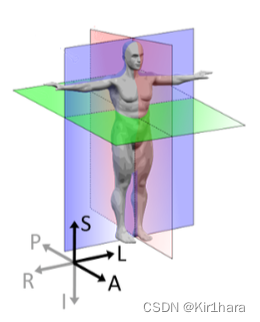
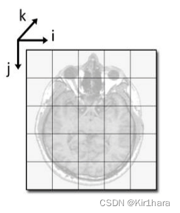

#### DICOM VTK 坐标系

数据元素实例

| Group | 	Element	Tag | Description                  | 	中文解释	              | VR  |
|-------|--------------|------------------------------|---------------------|-----|
| 0008	 | 0060	        | Modality	                    | 检查模态(MRI/CT/CR/DR)	 | CS  |
| 0020	 | 0032	        | Image Position (Patient)	    | 图像位置	               | DS  |
| 0020	 | 0037	        | Image Orientation (Patient)	 | 图像方位                | 	DS |
| 0020	 | 1041	        | Slice Location	              | 切片在某轴上的位置（通常是Z轴）    | DS  |
| 0018	 | 0050	        | Slice Thickness	             | 切片厚度(mm)	           | DS  |
| 0018	 | 0088	        | Spacing Between Slices	      | 切片间距(mm)            | 	DS |
| 0028	 | 0030	        | Pixel Spacing	               | 图像中每个像素的物理尺寸	       | DS  |

六个指向：

| 标识            | 方向  | 标识            | 方向  |
|---------------|-----|---------------|-----|
| Anteriort     | 前   | Posterior     | 后   |
| Left          | 左   | Right         | 右   |
| Superior/Head | 上/头 | Inferior/Feet | 下/脚 |

三个观察位：

- 冠状位（Coronal）：体前/体后观察人体（A-P），紫色面称为冠状面
- 矢状位（Sagittal）：体侧观察人体（ L-R），粉色面称为矢状面
- 横断位（Transverse）：头顶俯视/足底仰视人体（S-I），绿色面称为横断面或水平面

所谓的解剖坐标系，这是一个相对于特定患者的坐标系，通常用于描述患者身体内部结构的位置和方向。在患者坐标系中，原点通常被定义为患者身体的某个特定点，方向通常取上述六个方向其三。如常见的LPS坐标系，RAS坐标系。

像素坐标系 这是一个相对于特定图像的坐标系，通常用于描述图像中像素的位置。在像素坐标系中，原点通常被定义为图像的左上角，X轴从左到右，Y轴从上到下。（很多文章将像素坐标系与图像坐标系混淆，请注意）

### 获取DICOM标签值：我们需要以下三个标签的值：
- Image Position (Patient) (0020,0032)：这个标签包含三个值，分别表示图像平面左上角像素（也就是原点）在物理空间中的x、y、z坐标。这些值是相对于患者身体的，通常使用LPS（左后上）坐标系。
- Image Orientation (Patient) (0020,0037)：这个标签包含六个值，前三个值表示图像行（row）的方向，后三个值表示图像列（column）的方向。这些值是相对于患者身体的，通常使用LPS（左后上）坐标系。每个方向都是一个单位向量，表示该方向与x、y、z轴的夹角的余弦值。
- Pixel Spacing (0028,0030)：这个标签包含两个值，第一个值表示行间距（即垂直方向上相邻两像素的物理距离），第二个值表示列间距（即水平方向上相邻两像素的物理距离）。这些值通常以毫米为单位。
### 计算行和列向量：我们将Image Orientation (Patient)标签的前三个值和后三个值分别乘以Pixel Spacing标签的值，得到行和列向量。
### 计算切片向量：我们计算行和列向量的叉积，得到切片向量。
### 构建仿射矩阵：我们将行向量、列向量和切片向量作为仿射矩阵的前三列，将Image Position (Patient)标签的值作为仿射矩阵的最后一列。最后一行是[0, 0, 0, 1]。
————————————————

                            版权声明：本文为博主原创文章，遵循 CC 4.0 BY-SA 版权协议，转载请附上原文出处链接和本声明。

原文链接：https://blog.csdn.net/Kir1hara/article/details/132088944

原文链接：https://blog.csdn.net/Kir1hara/article/details/132088944